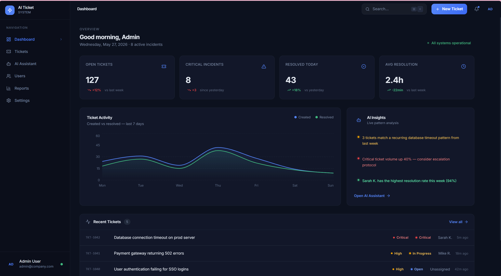
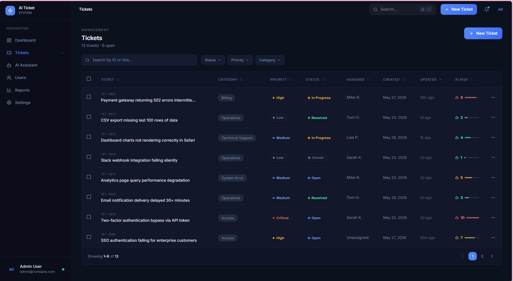
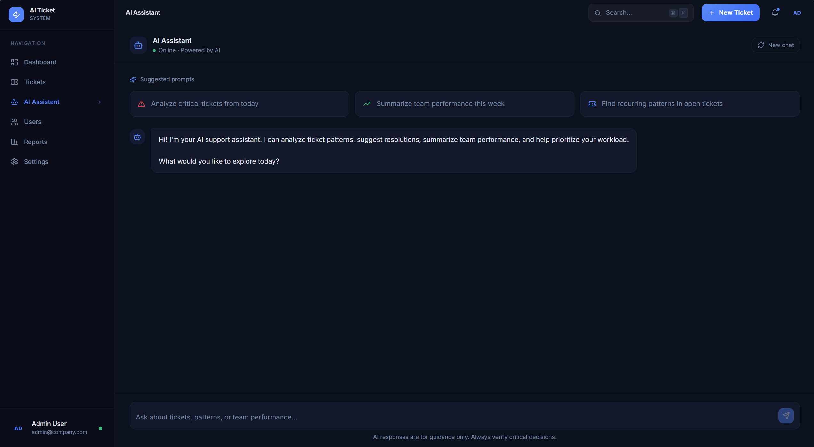
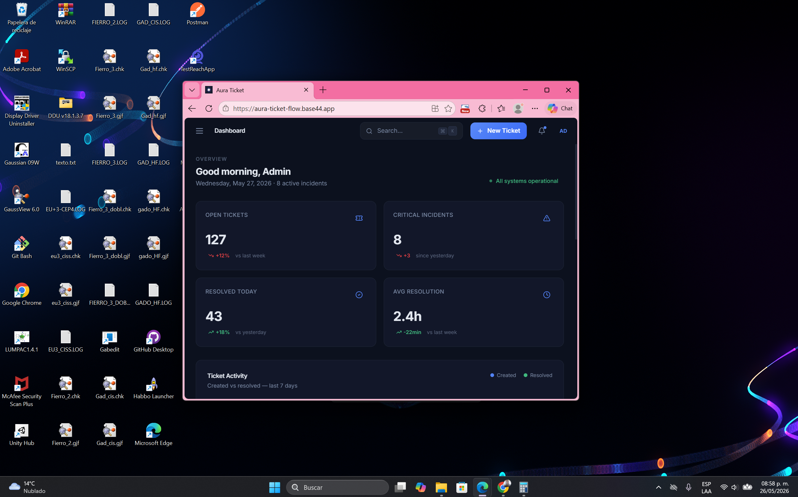

# AI Ticket System

AI-powered enterprise ticket management platform built with a modern SaaS dashboard architecture.

---

# Overview

AI Ticket System is a modern incident management and technical support platform inspired by enterprise SaaS products like Linear, Jira, Stripe Dashboard, and Notion.

The application focuses on intelligent ticket workflows, AI-assisted incident analysis, and premium user experience design.

---

# Features

- Modern SaaS dashboard UI
- Enterprise ticket management system
- AI-powered ticket insights
- Incident priority analysis
- Ticket categorization
- Dashboard analytics
- Interactive charts
- Activity timeline
- Ticket filtering & search
- Modern responsive layout
- Modular architecture
- Dark premium UI design

---

# Modules

## Dashboard
- Metrics overview
- Ticket analytics
- AI insights panel
- Incident monitoring
- Activity charts

## Tickets
- Ticket table
- Priority badges
- Status management
- Filtering & sorting
- AI risk indicators

## AI Assistant
- AI incident analysis
- Smart recommendations
- Ticket summaries
- Suggested actions

## Users
- User management
- Team overview

## Reports
- Incident reporting
- Analytics visualization

## Settings
- Application settings
- Profile management

---

# Screenshots

## Dashboard

---

## Tickets

---

## AI Assistant

---

## SaaS Layout

---

# Tech Stack

- React
- Vite
- Tailwind CSS
- JavaScript
- Modern SaaS UI Architecture

---

# Live Demo

https://aura-ticket-flow.base44.app

---

# Project Goals

This project was created to simulate a real-world enterprise support platform focused on:
- scalable UI architecture
- modern SaaS design systems
- AI-assisted workflows
- enterprise dashboard experiences

---

# Author

Adriel Yulissa Hernández Albarrán